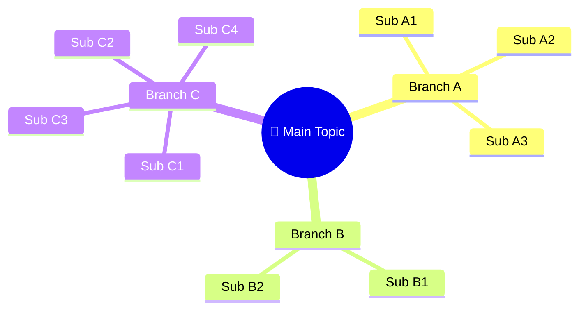
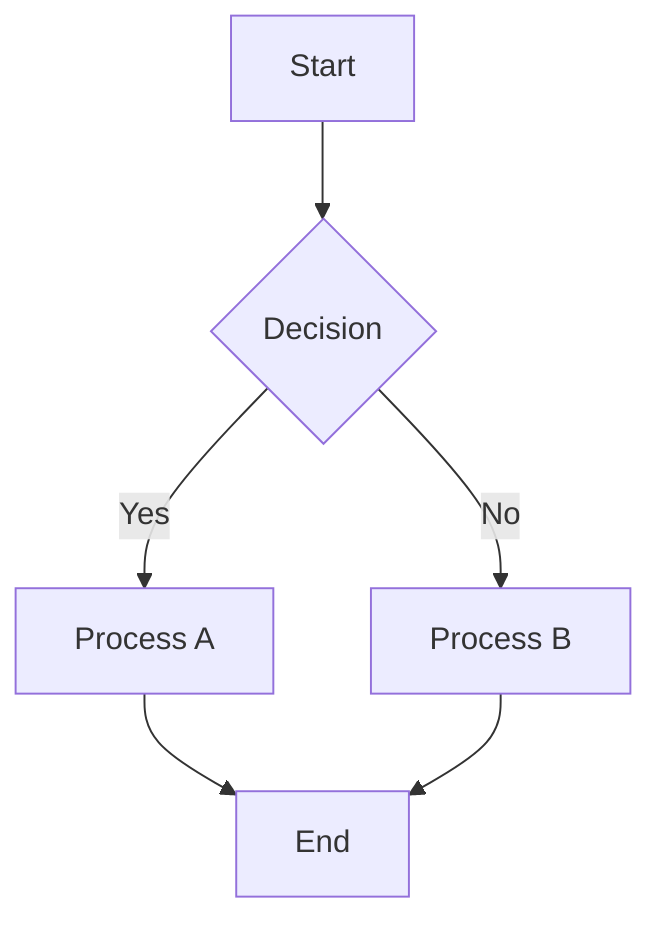

# Test Sizing Fixes for TikZ and Mermaid

## TikZ Diagram Sizing Test

### Small Tall Diagram (Portrait)
```tikz
\begin{tikzpicture}[scale=0.8]
  \draw (0,0) -- (1,3) -- (2,0) -- cycle;
  \fill (0,0) circle (0.1);
  \fill (1,3) circle (0.1);
  \fill (2,0) circle (0.1);
\end{tikzpicture}
```

### Wide Diagram (Landscape)
```tikz
\begin{tikzpicture}[scale=1]
  \draw (0,0) rectangle (8,2);
  \draw[red] (1,1) circle (0.5);
  \draw[blue] (4,1) circle (0.5);
  \draw[green] (7,1) circle (0.5);
  \draw[->, thick] (1.5,1) -- (3.5,1);
  \draw[->, thick] (4.5,1) -- (6.5,1);
\end{tikzpicture}
```

### Complex Balanced Diagram
```tikz
\usetikzlibrary{shapes}
\begin{tikzpicture}[scale=1.2]
  \node[draw, circle, minimum size=1cm] (center) at (0,0) {A};
  \node[draw, rectangle, minimum size=1cm] (left) at (-2,0) {B};
  \node[draw, circle, minimum size=1cm] (right) at (2,0) {C};
  \node[draw, rectangle, minimum size=1cm] (top) at (0,2) {D};
  \node[draw, circle, minimum size=1cm] (bottom) at (0,-2) {E};
  \draw (center) -- (left) -- (top) -- (right) -- (bottom) -- (center);
\end{tikzpicture}
```

## Mermaid Mindmap Centering Test



## Flowchart for Comparison


